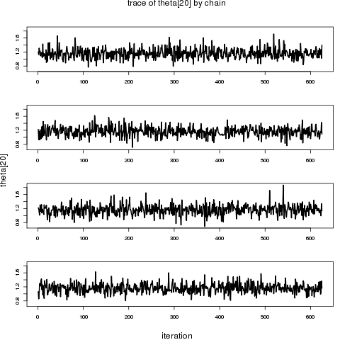
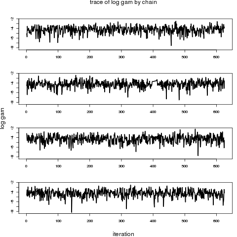
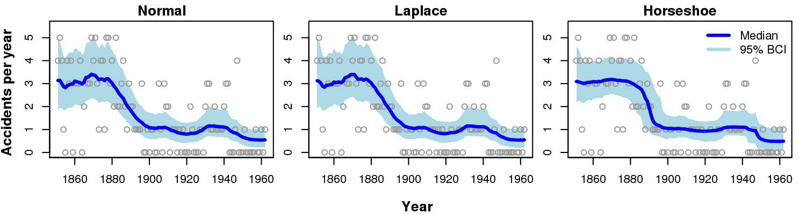

The following document provides `R` code for fitting Bayesian trend filter models using the `bnps` package applied to a data example on coal mine disasters which is presented in Faulkner and Minin (2015). See the [Introduction to the bnps package](introduction_to_bnps.html) for instructions on installation and more details about the package.


## Data

The data are number of disasters per year for the years 1851-1962.  The following code loads the `coal` data frame and creates a list with the data components needed for `bnps` to run the models.  See the package documentation for more details on the coal data set.

```{r eval=FALSE}
# load coal data
data(coal)

# set up data list for bnps
coal_dat <- list(J = nrow(coal), y = coal$events)

```

## Run Models

In the paper we compare three different configurations for the prior distributions on the order-*k* differences in latent function values (normal, Laplace, and horseshoe).  The following code will set up a list of parameters to keep in the output, set up some model run parameters, and will run the models with the `bnps` function.  Then the posterior samples are extracted into an array and posterior median and 95% Bayesian credible intervals are calculated for the theta (latent trend) parameters.  Note that the normal model takes about 5 seconds to run per chain, the Laplace model about 20-30 seconds per chain, and the horseshoe about 40-50 seconds per chain.  Of course results will differ depending on your computer set up. 


```{r eval=FALSE}
# Parameters to keep 
pars.N <- c("theta", "gam") 
pars.L <- c("theta", "tau", "gam") 
pars.H <- c("theta", "tau", "gam") 

# MCMC settings
nchain <- 4
ntotsamp <- 2500
nthin <- 5
nburn <- 500
niter <- (ntotsamp/nchain)*nthin + nburn

# Run models
cfit.N <- bnps(prior="normal", likelihood="poisson", order=1, data=coal_dat, par=pars.N, 
					chains=nchain, warmup=nburn, thin=nthin, iter=niter)
cfit.L <- bnps(prior="laplace", likelihood="poisson", order=1, data=coal_dat, par=pars.L, 
					chains=nchain, warmup=nburn, thin=nthin, iter=niter)
cfit.H <- bnps(prior="horseshoe", likelihood="poisson", order=1, data=coal_dat, par=pars.H, 
					chains=nchain, warmup=nburn, thin=nthin, iter=niter)

# Extract posterior draws
cout.N <- as.array(cfit.N)
cout.L <- as.array(cfit.L)
cout.H <- as.array(cfit.H)

# Get posterior summary for theta
th.N <- extract_theta(cfit.N, obstype="poisson")
th.L <- extract_theta(cfit.L, obstype="poisson")
th.H <- extract_theta(cfit.H, obstype="poisson")

```

## Diagnostics

Next we check some posterior diagnostics of the parameters.  The `print.stanfit` function (called with `print`) from the `rstan` package provides posterior summaries of the parameters and effective sample size estimates and Gelman-Rubin statistics.  We use the `plot_trace` function from the `bnps` package to check the traces of a few parameters for the horseshoe model.  Two of those plots are shown below. 

```{r eval=FALSE}

# Print parameter summaries
print(cfit.N)
print(cfit.L)
print(cfit.H)

# Some example trace plots for the horseshoe model
plot_trace(cout.H, "theta[10]", pscale="original", stack=TRUE, colset="black")
plot_trace(cout.H, "tau[10]", pscale="log", stack=TRUE, colset="black")
plot_trace(cout.H, "gam", pscale="log", stack=TRUE, colset="black")


```





## Posterior Plots

Now we use the `plot_trend` function from the `bnps` package to plot the posterior medians and 95% credible intervals for the three models along with the data points.  See the documentation for `plot_trend` for more details on the available options.  The code below produces a PNG file, but you can simply pull out the calls to `plot_trend` for your own use.

```{r eval=FALSE}

yrng <- c(0,5.5)
png(filename='coal_plots.png', width=1500, height=400, res=200)
  par(mfrow=c(1,3), mar=c(2,1.5,1.5,1), oma=c(2,2,0,0))
  plot_trend(theta=th.N, obstype="poisson", obsvec=coal$events, timelab=coal$year, main="Normal", 
		xlab="", ylab="", ylim=yrng)
  plot_trend(theta=th.L, obstype="poisson", obsvec=coal$events, timelab=coal$year,, main="Laplace", 
		xlab="", ylab="", ylim=yrng)
  plot_trend(theta=th.H, obstype="poisson", obsvec=coal$events, timelab=coal$year, main="Horseshoe", 
		xlab="", ylab="", ylim=yrng)
 legend(x="topright", legend=c("Median", "95% BCI"), col=c("blue","lightblue"), lwd=3, bty="n", cex=1)
 mtext(side=1, outer=T, line=1, text="Year", font=2, cex=0.8)
 mtext(side=2, outer=T, line=1, text="Accidents per year", font=2, cex=0.8)
dev.off()


```




## References

Faulkner, J.R., and V.N. Minin.  2015.  Bayesian trend filtering: adaptive temporal smoothing with shrinkage priors. arXiv preprint.


