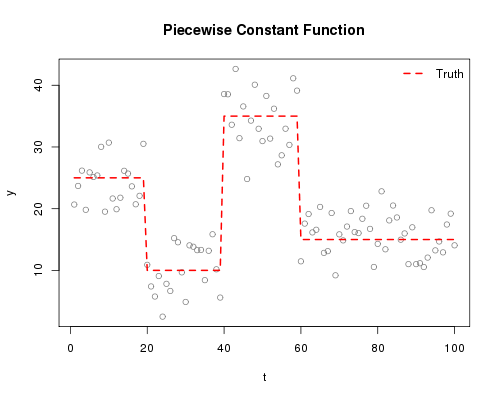
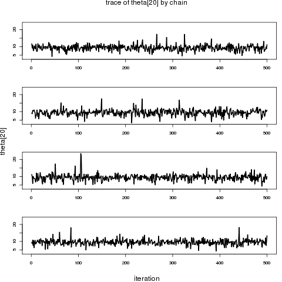
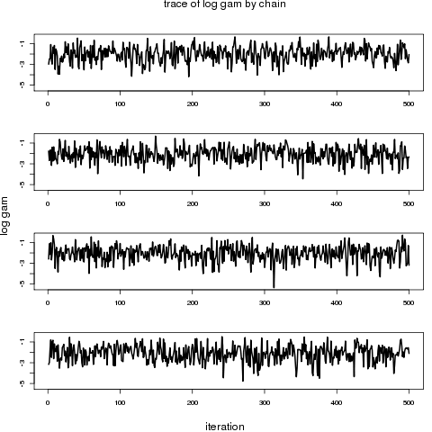
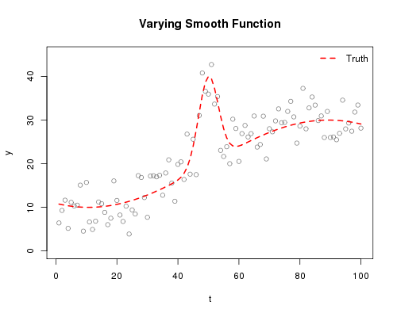
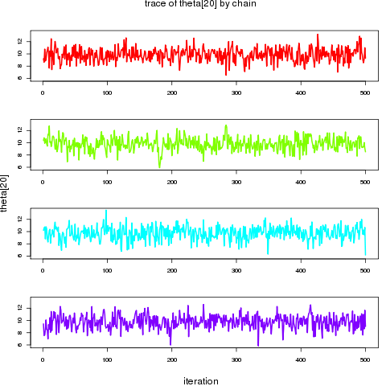
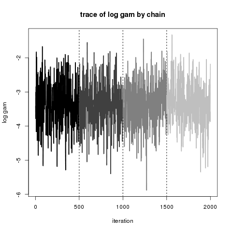
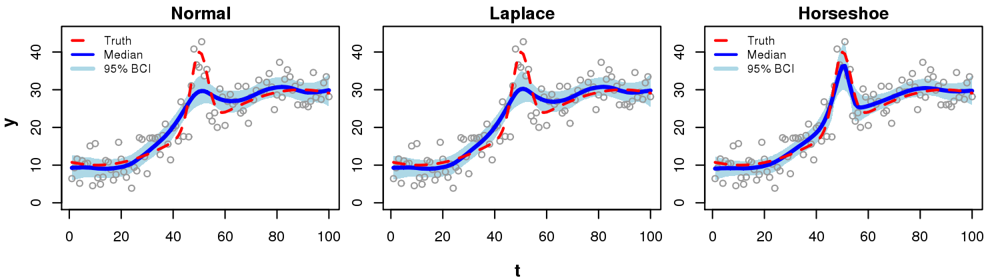

The following document provides example code for implementing the Bayesian trend filter as described in Faulkner and Minin (2015) using the `R` package `bnps`.  You can simply copy and paste the code presented here to your `R` terminal window or to a script file to run it.  We use Hamiltonion Monte Carlo (HMC) to target the posterior distributions of the parameters.  For this, we take advantage of the computing package [`Stan`](http://mc-stan.org/), which offers a straight-forward and efficient interface for implementing HMC.  Some preliminary setup is necessary to install the needed software, which we describe in what immediately follows. 


## Preliminary Requirements
### Install Software
All code presented here is for the `R` computing environment.  If you do not already have `R`, then please visit the [`R` CRAN website](http://cran.us.r-project.org/) and follow instructions for installation.  The model fitting depends on the [`RStan`](http://mc-stan.org/interfaces/rstan.html) interface to the [`Stan`](http://mc-stan.org/) computing language.  If you do not already have the `R` package `rstan` installed, then please follow the [RStan Getting Started Guide](https://github.com/stan-dev/rstan/wiki/RStan-Getting-Started#prerequisites) before proceeding.  If you are using a Windows platform, you may need to first install the [`Rtools` package](https://cran.r-project.org/bin/windows/Rtools/) if you do not already have it.  If you are using a Mac, you need to make sure `Xcode` is installed.  Please make sure you have `rstan` successfully installed before proceeding further. 

Once you have `rstan` installed, you just have to load the package using 
```{r eval=FALSE}
library(rstan)
```

Next you need to install the `devtools` package, which will provide functions to allow easy installation of the `bnps` package from GitHub.  You can easily install `devtools` using `install.packages("devtools")`.  Once `devtools` is installed, you are ready to install the `bnps` package.  This package is hosted on GitHub at [http://github.com/jrfaulkner/bnps](http://github.com/jrfaulkner/bnps), and can be installed using 

```{r, eval=FALSE}
intstall_github("jrfaulkner/bnps", build_vignettes=TRUE)
```
Once you have `bnps` installed, attach it using

```{r eval=FALSE}
library(bnps)
```
Now you are ready to start fitting models.

## Example Function Fits
Here we use two examples of fitting models where data are simulated from known functions.  The two functions were used in simulations presented in Faulkner and Minin (2015).  The first function is a piecewise constant function and the second is a function with varying smoothness (also known as the "Mexican hat" function).  These functions are best fit with models that allow adaptation to the sharp local features that the functions exhibit.     

In Faulkner and Minin (2015) we compare three different configurations for the prior distributions on the order-*k* differences in latent function values (normal, Laplace, and horseshoe).  The normal prior is the default used in Gaussian Markov random field (GRMF) models, and is not considered locally adaptive.  The Laplace and horseshoe priors are types of shrinkage priors.  These two formulations allow some locally-adaptive behavior, with the horseshoe being the most adaptive of the two. Given the results in Faulkner and Minin (2015), we recommend using the horseshoe prior as a default prior because it provides the better adaptive smoothing properties than the Laplace prior.  More extreme shrinkage priors than the horseshoe have been developed that could provide better locally-adaptive smoothing, but we currently only have code available for the Laplace and horseshoe shrinkage priors.  We encourage you to explore different prior formulations with your own modifications to our code. 


### Piecewise Constant Function
The following code sets up the piecewise constant function and generates a set of independent normally distributed observations.  For this example, the standard deviations of the observations is 4.5, which corresponds to a signal-to-noise ratio of 2.  The generated plot shows the true function and the simulated data.
```{r eval=FALSE,  fig.height=4, fig.width=5, fig.align='center'}
# Set up function
nx <- 100
xv <- (1:nx)/nx
mpc <- rep(25, nx) 
mpc[xv >= 0.2 & xv < 0.4] <- 10 
mpc[xv >= 0.4 & xv < 0.6] <- 35 
mpc[xv >= 0.6] <- 15

# Generate data
set.seed(3)
pc.sd <- 4.5
pc.norm <- rnorm(n=nx, mean=mpc, sd=pc.sd)

# Create data list for passage to bnps
pcdat.norm <- list(J = nx, y = pc.norm)

# Plot function and data
plot(1:nx, pc.norm, xlab="t", ylab="y", main="Piecewise Constant Function")
lines(1:nx, mpc, lwd=2, col="red")
legend('topright', legend="Truth", lty=1, lwd=2, col="red", bty="n")

```


Now we are ready to fit some models using the `bnps` function.  It is important to know that this function is a wrapper for the `stan` function in the `rstan` package.  The `bnps` function has a few arguments for describing the model you want to run, but it also accepts most of the arguments of the `stan` function (see `bnps` documentation for details).  Given the overlap between the `bnps` and `stan` functions, it would be beneficial to familiarize yourself with the `stan` function and its inputs.  

Some of the model parameters may not be of interest in posterior summaries, including those that the model code generates due to parameter transformations.  We can tell the `bnps` function to give us output only for the parameters of interest.  We set up the following character vectors to specify the parameters of interest for later summaries.  We are really only interested in the theta (latent trend) parameters, but have included others for posterior diagnostic checks (see Faulkner and Minin (2015) for description of models and associated parameters).


```{r eval=FALSE}
# Parameters to keep 
# for model with normal prior
pars.N <- c("theta", "gam", "sigma") 
# for model with Laplace prior
pars.L <- c("theta", "tau", "gam", "sigma") 
# for model with horseshoe prior
pars.H <- c("theta", "tau", "gam", "sigma") 

```

The `rstan` package is built on C++ code.  Before running a model, the model code needs to be compiled, which can take 30-60 seconds or so for each model. If you need to run a model multiple times and all you need to change for each run is the input data, or the number of iterations, warmup (burn-in) period, thinning level or something else without changing the structure of the model itself, you can compile a model object once and then refer to that object in subsequent calls to `bnps` without re-compiling each time. Next we create initial model fit objects that can be called upon many times without re-compiling.  This is not necessary in the examples we present here, but is shown so you are aware of the possibility.

```{r eval=FALSE}

# Compile model objects
# -- GMRF
ipcfit.N <- bnps(prior="normal", likelihood="normal", order=1, zeta=0.01, 
							data=pcdat.norm, chains=0)
# -- Laplace
ipcfit.L <- bnps(prior="laplace", likelihood="normal",  order=1, zeta=0.01, 
							data=pcdat.norm, chains=0)
# -- Horseshoe
ipcfit.H <- bnps( prior="horseshoe", likelihood="normal", order=1, zeta=0.01, 
							data=pcdat.norm, chains=0)
		
```

Next we pass these compiled objects to `bnps` for the actual MCMC runs by specifying the compiled fit objects with the `fit` argument.  Before that we need to set up the MCMC run parameters common to each run.  We run 4 chains for each model with each chain having a burn-in (warm-up) period of 500 draws and a thinning level of every 5 samples.  The total number of posterior samples we want to keep here will be 2000, which means each chain requires 3000 total iterations including burn-in and before thinning.  Depending on the configuration of your computer, the model with normal prior may take about 10-20 seconds per chain to run, while the other two models may take 60-120 seconds per chain, with the horsehoe model taking the longest. 

```{r eval=FALSE}
# MCMC run settings
nchain <- 4
ntotsamp <- 2000
nthin <- 5
nburn <- 500
niter <- (ntotsamp/nchain)*nthin + nburn

# Model with normal prior 
pcfit.N <- bnps(prior="normal", likelihood="normal", order=1, fit=ipcfit.N, data=pcdat.norm, 
							par=pars.N,	chains=nchain, warmup=nburn, thin=nthin, iter=niter)
# Model with Laplace prior
pcfit.L <- bnps(prior="laplace", likelihood="normal",  order=1,  fit=ipcfit.L, data=pcdat.norm, 
							par=pars.L,	chains=nchain, warmup=nburn, thin=nthin, iter=niter)
# Model with horseshoe prior
pcfit.H <- bnps( prior="horseshoe", likelihood="normal", order=1,  fit=ipcfit.H, data=pcdat.norm, 
							par=pars.H, chains=nchain, warmup=nburn, thin=nthin, iter=niter)

```


Now that the MCMC runs are complete, we want to extract the posterior samples from the model fit objects.  We can do this in various ways using methods provided in the `rstan` package.  Specifically, these are `extract`, `as.array.stanfit`, `as.matrix.stanfit`, and `as.data.frame.stanfit` (Note: drop 'stanfit' from the function names when calling).  The `extract` function (as opposed to the others) allows you to keep the burn-in samples, but you have to be careful of the `permuted=TRUE` default setting of `extract` which permutes all of your samples -- not a good thing to do if you are trying to assess a trace plot or calculate autocorrelations.  The `as.array` function automatically drops the burn-in samples and puts your samples (not permuted) in a three-dimensional array, where the first dimension indexes the iterations, the second the chains, and the third the parameters. Next we use the `as.array` function to extract the posterior samples.  We also use the `extract_theta` function from the `bnps` package to calculate the posterior median and 95% Bayesian credible intervals for the theta (latent trend) parameter vector.

```{r eval=FALSE}
# extract posterior samples
pcout.N <- as.array(pcfit.N)
pcout.L <- as.array(pcfit.L)
pcout.H <- as.array(pcfit.H)

# extract posterior median and 95% BCIs for theta
theta.N <- extract_theta(pcfit.N, obstype="normal", alpha=0.05)
theta.L <- extract_theta(pcfit.L, obstype="normal", alpha=0.05)
theta.H <- extract_theta(pcfit.H, obstype="normal", alpha=0.05)

```

#### Diagnostics 

Here we provide some tools for assessing the mixing and convergence of the parameters.  This can be a challenge because there are hundreds of parameters for each model.  However, the task can be simplified some by focusing on the lower level parameters in the model hierarchy.  These parameters may display convergence problems even when the higher level parameters appear to have good posterior sample properties. There are various tools in both the `rstan` and `bnps` packages for assessing mixing and convergence, and you can also use functions in the `coda` package to assess convergence.  The `rstan` function `print.stanfit` (called with `print`) will provide a table of summary statistics for each parameter including effective sample size estimates and the potential scale reduction factors (R_hat). The `plot_chains` function in the `bnps` package allows you to plot the traces of the separate chains by parameter, with various options for transformations of parameters, colors of traces, and formatting of the plots.  The following code produces plots for a few parameters from the horseshoe model fits, but the plots shown below are just for parameters 'theta[20]' and 'gam' (gamma).

```{r eval=FALSE}

# example trace plots for horseshoe model
plot_trace(pcout.H, "theta[20]", pscale="original", stack=TRUE, colset="black")
plot_trace(pcout.H, "tau[20]", pscale="log", stack=TRUE, colset="black")
plot_trace(pcout.H, "gam", pscale="log", stack=TRUE, colset="black")

```





#### Plots of Posterior Trend 

The `plot_trend` function in the `bnps` package allows you to plot the posterior median and associated credible intervals for the theta parameters. There are various options for how the parameters are passed to the function, as well as options for colors and for plotting the data.  The following is code used to create the embedded PNG file for the figure shown below. 

``` {r eval=FALSE}

# Create plots of posterior trend for all 3 models
yrng <- c(0,45)
png(filename='pc_plots.png', width=1500, height=420, res=200)
  par(mfrow=c(1,3), mar=c(2,1.5,1.5,1), oma=c(2,2,0,0))
  plot_trend(theta=theta.N, obstype="normal", obsvec=pc.norm, pt.cex=0.9, main="Normal", 
		xlab="", ylab="", ylim=yrng)
  lines(1:nx, mpc, lwd=2, lty=2, col="red")
  plot_trend(theta=theta.L, obstype="normal", obsvec=pc.norm, pt.cex=0.9, main="Laplace", 
		xlab="", ylab="", ylim=yrng)
  lines(1:nx, mpc, lwd=2, lty=2, col="red")
  plot_trend(theta=theta.H, obstype="normal", obsvec=pc.norm, pt.cex=0.9, main="Horseshoe", 
		xlab="", ylab="", ylim=yrng)
  lines(1:nx, mpc, lwd=2, lty=2, col="red")
  legend(x="topright", legend=c("Truth", "Median", "95% BCI"), col=c("red", "blue","lightblue"),
			lty=c(2,1,1), lwd=c(2,2,3), bty="n", cex=0.8)
  mtext(side=1, outer=T, line=1, text="t", font=2, cex=0.8)
  mtext(side=2, outer=T, line=1, text="y", font=2, cex=0.8)
dev.off()

```


### Varying Smooth Function
We repeat the above steps for fitting the "Mexican hat" (varying smoothness) function.  For this example, we fit second-order models using the three formulations for the priors on the latent trend parameters (theta).  

First create the trend function and generate data and plot.

```{r eval=FALSE}
# Set up generating function
nx <- 100
xv <- (1:nx)/nx
ygfun <- function(x){
   sin(x) + 2*exp(-30*x^2)
}
gseq <- seq(-2,2,length=101)
mvs1 <- 20 + 10*ygfun(gseq)
mvs <- mvs1[-1]

# Generate data
set.seed(3)
vs.sd <- 4.5
vs.norm <- rnorm(n=nx, mean=mvs, sd=vs.sd)
vsdat.norm <- list(J = nx, y = vs.norm)

# Plot function and data
plot(1:nx, vs.norm, ylim=c(0,45), xlab="t", ylab="y", col="gray50", main="Varying Smooth Function")
lines(1:nx, mvs, lty=2, lwd=2, col="red")
legend('topright', legend="Truth", lty=2, lwd=2, col="red", bty="n")

```



Next we fit the models without compiling separately and we keep the same parameters as in the example for the piecewise constant function and extract the posterior draws and posterior summaries for theta. Note that the second-order models take longer to run, with the normal model taking about 30-60 seconds per chain, the Laplace model about 2-3 minutes per chain, and the horseshoe about 7-9 minutes per chain.

```{r eval=FALSE}

# Compile and run bnps models for varying smooth (vs) funtion
# -- GMRF
vsfit.N <- bnps(prior="normal", likelihood="normal", order=2, data=vsdat.norm, 
								par=pars.N,	chains=nchain, warmup=nburn, thin=nthin, iter=niter)
# -- Laplace
vsfit.L <- bnps(prior="laplace", likelihood="normal",  order=2, data=vsdat.norm, 
								par=pars.L,	chains=nchain, warmup=nburn, thin=nthin, iter=niter)
# -- Horseshoe
vsfit.H <- bnps(prior="horseshoe", likelihood="normal", order=2, data=vsdat.norm, 
								par=pars.H,	chains=nchain, warmup=nburn, thin=nthin, iter=niter)

# extract posteriors
vsout.N <- as.array(vsfit.N)
vsout.L <- as.array(vsfit.L)
vsout.H <- as.array(vsfit.H)

# create posterior summaries for theta					
thvs.N <- extract_theta(vsfit.N, obstype="normal", alpha=0.05)
thvs.L <- extract_theta(vsfit.L, obstype="normal", alpha=0.05)
thvs.H <- extract_theta(vsfit.H, obstype="normal", alpha=0.05)

```


#### Diagnostics

The following code produces summaries for all models and a few trace plots for the horseshoe model, this time in a few different formats.   

```{r eval=FALSE}

# print parameter summaries
print(vsout.N)
print(vsout.L)
print(vsout.H)

# example trace plots for horseshoe model
plot_trace(vsout.H, "theta[20]", pscale="original", stack=TRUE, colset="color")
plot_trace(vsout.H, "tau[20]", pscale="log", stack=FALSE, colset="black")
plot_trace(vsout.H, "gam", pscale="log", stack=FALSE, colset="gray")
plot_trace(vsout.H, "sigma", pscale="log", stack=TRUE, colset="black")

```





#### Plots of Posterior Trend

Finally we plot the posterior medians and credible intervals for the theta (latent trend) parameters for the three models and compare them to the line for the true function.  The code below is for producing the plot shown below, but you can just pull out the calls to `plot_trend` for your own purposes.

```{r eval=FALSE}

yrng <- c(0,45)
png(filename='vs_plots.png', width=1500, height=420, res=200)
  par(mfrow=c(1,3), mar=c(2,1.5,1.5,1), oma=c(2,2,0,0))
  plot_trend(theta=thvs.N, obstype="normal", obsvec=vs.norm, pt.cex=0.9, main="Normal", 
		xlab="", ylab="", ylim=yrng)
  lines(1:nx, mvs, lwd=2, lty=2, col="red")
  legend(x="topleft", legend=c("Truth", "Median", "95% BCI"), col=c("red", "blue","lightblue"),
			lty=c(2,1,1), lwd=c(2,2,3), bty="n", cex=0.8)
  plot_trend(theta=thvs.L, obstype="normal", obsvec=vs.norm, pt.cex=0.9, main="Laplace", 
		xlab="", ylab="", ylim=yrng)
  lines(1:nx, mvs, lwd=2, lty=2, col="red")
  plot_trend(theta=thvs.H, obstype="normal", obsvec=vs.norm, pt.cex=0.9, main="Horseshoe", 
		xlab="", ylab="", ylim=yrng)
  lines(1:nx, mvs, lwd=2, lty=2, col="red")
  legend(x="topleft", legend=c("Truth", "Median", "95% BCI"), col=c("red", "blue","lightblue"),
			lty=c(2,1,1), lwd=c(2,2,3), bty="n", cex=0.8)
  mtext(side=1, outer=T, line=1, text="t", font=2, cex=0.8)
 mtext(side=2, outer=T, line=1, text="y", font=2, cex=0.8)
dev.off()


```




## Parallelization

Some of these models can be quite time consuming to fit.  If you have access to a computer with multi-core processors, you can greatly reduce the fitting time by parallelizing the processes.  The following example uses the `mclapply` function from the `parallel` package to distribute posterior sampling of different chains to different processor cores.  Make sure you have multi-core processors on your computer before running this.    

```{r eval=FALSE}
# Sampling setting
nchain <- 4
ntotsamp <- 2000
nthin <- 5
nburn <- 500
niter <- (ntotsamp/nchain)*nthin + nburn
chnlist <- 1:4

# Compile fit object
ivsfit.H <- bnps(prior="horseshoe", likelihood="normal", order=2, data=vsdat.norm, 
						chains=0, par=pars.H)

# Run model separately per chain -- one per core
tmp.sflist.H <- mclapply(1:nchain, mc.cores = nchain, function(xx) bnps(prior="horseshoe",
							fit=likelihood="normal", order=2, fit=ivsfit.H, data=vsdat.norm, par=pars.H, 
							chains=1, warmup=nburn,	thin=nthin, iter=niter, chain_id=chnlist[xx], refresh=-1) )

# Convert list to stanfit object
vsfit.H <- sflist2stanfit(tmp.sflist.H)

# Extract posteriors into array
vsout.H <- as.array(vsfit.H)


```

## References

Faulkner, J.R., and V.N. Minin.  2015.  Bayesian trend filtering: adaptive temporal smoothing with shrinkage priors. arXiv preprint arXiv:1512.06505.


