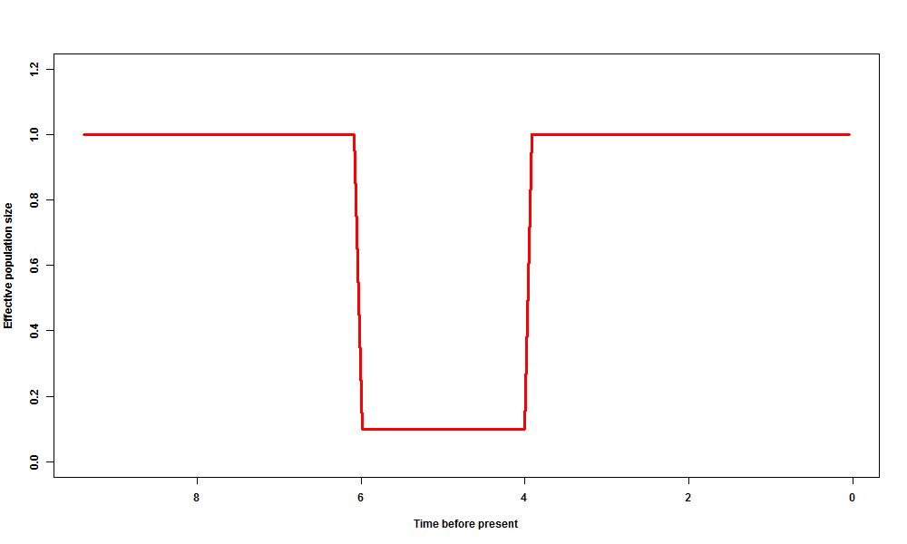
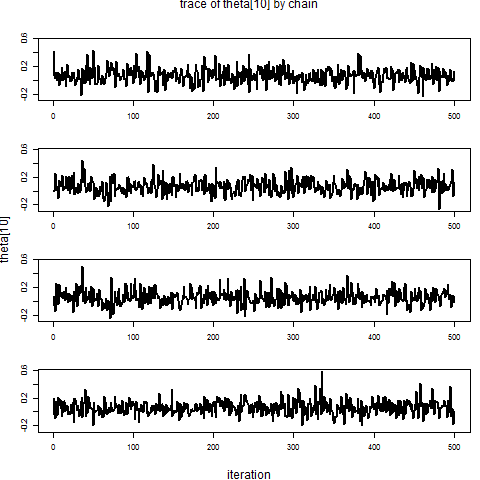
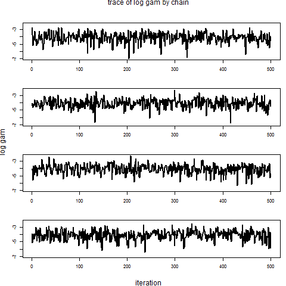
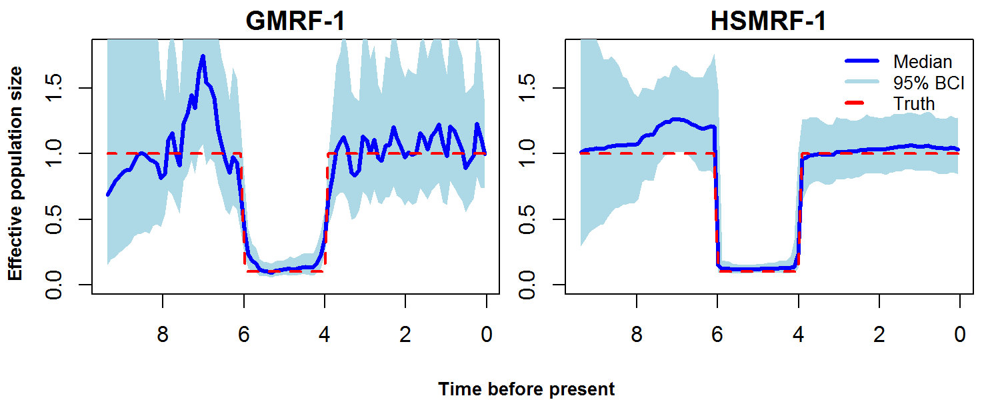
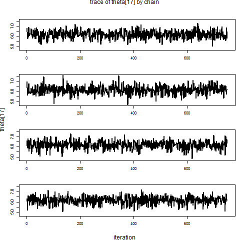
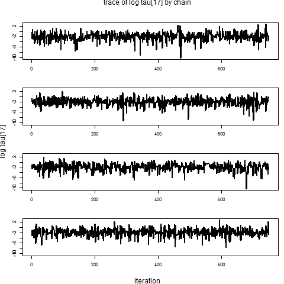
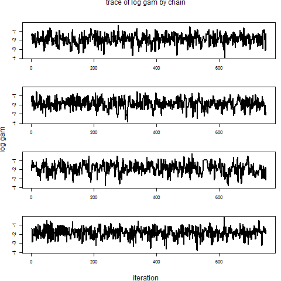
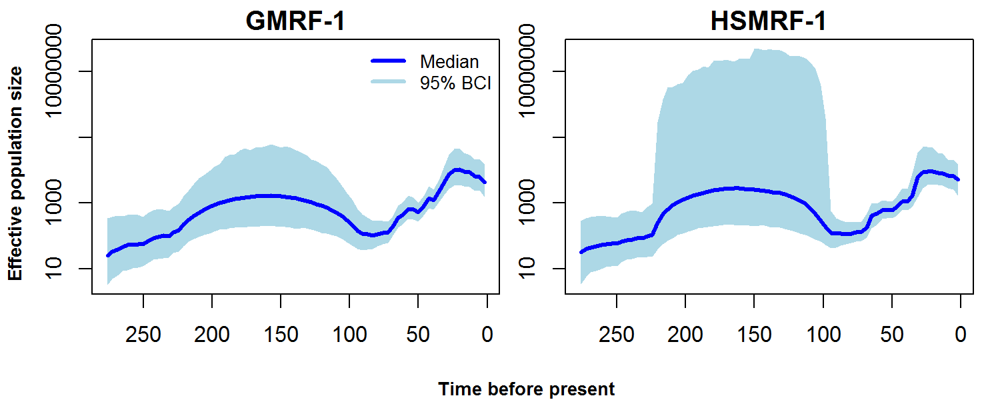

The following document provides `R` code for fitting shrinkage prior Markov random field models using the `spmrf` package applied to coalescent time data for phylodynamic inference of effective population size trajectories, as described in Faulkner et al. (2018). See the [Introduction to the spmrf package](introduction_to_spmrf.html) for instructions on installation and more details about the package. Note that the `spmrf` function only operates on coalescent time data and cannot be used directly on sequence data nor to infer parameters for trait evolution models.


## Install Necessary Packages

Make sure you have `spmrf` and `rstan` installed, then load the libraries.

```{r eval=FALSE}
library(spmrf)
library(rstan)
```

## Simulated Data Example

We will start with a set of simulated coalescent data generated from a scenario used in Faulkner et al. (2018).  This example represents an extreme bottleneck in effective population size.  First we simulate the coalescent data given the specified population trajectory, set up the grid over which we will estimate effective population size, and create the data list for input to `spmrf`. Note that the effective population sizes are very small and that was done to decrease the coalescent times to make the time scale more compact.


```{r eval=FALSE}

# set random number seed for reproducibility
set.seed(5)

# Generate simulated data
nsamp <- 500   #number of samples total
nstart <- 50   #number of samples at time zero
nbndry <- 101  #number of grid cell boundaries (number of cells plus 1)
samp.end <- 8  #last potential sample time
samptv <- c(0, sort(runif(nsamp-nstart, 0, samp.end)) ) #vector of sample times
nsampv <- c(nstart, rep(1, nsamp-nstart))  #vector of number sampled
# simulate coalescent times
coaldat <- coaltimeSim(samp_times = samptv, n_sampled = nsampv, 
			traj = bottleNeck_traj, lower_bound = 0.1, ne.max=1, ne.min=0.1, bstart=6, bend=4  )

# Calculate a grid for estimation
sgrid <- makeGrid(coal_times = coaldat$coal_times, samp_times = samptv, Ngrid=nbndry)

# Make data set for input to spmrf
cdat <-  make_coalescent_data(samp_times = samptv, n_sampled = nsampv, coal_times = coaldat$coal_times, grid = sgrid$grid)

```

We can take a look at what the population trajectory looks like by plotting it over the midpoints of the grid. Note that we reverse the coordinates of the x-axis so that we go backwards in time from the present.

```{r eval=FALSE}

# Calculate trajectory over the grid
truetraj <- bottleNeck_traj(t = sgrid$midpts, lower_bound = 0.1, ne.max=1, ne.min=0.1, bstart=6, bend=4)

# Plot
plot(sgrid$midpts, truetraj, xlim=range(rev(sgrid$midpts)), ylim=c(0, 1.2), type="l", col="red",
     xlab="Time before present", ylab="Effective population size")

png(file="vignettes/figure/phylo_bottleneck_traj.png", width=1000, height=600)
par(font.axis=2, font.lab=2)
plot(sgrid$midpts, truetraj, xlim=range(rev(sgrid$midpts)), ylim=c(0, 1.2), type="l", col="red",
     xlab="Time before present", ylab="Effective population size", lwd=3)
dev.off()


```



Next we will fit the model using two different priors for the effective population size. The first prior is the standard Gaussian Markov random field (GMRF) and the second is the horseshoe Markov random field (HSMRF). The first step is to calculate a reasonable value for the hyperparameter `zeta`, which controls the scale of the half-Cauchy prior that controls the global level of smoothing in the models. We will use the same value of `zeta` for both models.  We then set up the MCMC settings and run the models. Note that once `spmrf` builds the model code and calls stan, the model code gets transfered to C++ and compiled.  This process takes about 30 seconds for each model. Note that `stan` may show some warnings at the beginning which can be ignored.  For the GMRF model, once the code compilation was complete, each chain took approximately 45 seconds to run on my machine, for a total run time of about 4 minutes.  For the HSMRF model, each chain took about 2-3 minutes to run, for a total run time of about 12 minutes.  Once the sampling is complete for each model, we then capture the posterior samples and get posterior summaries for the effective population size parameters. 

```{r eval=FALSE}

# Set hyperparameter for global scale
zeta <- set_zeta_phylo(phylo = coaldat, ncell = 100, alpha = 0.05, order = 1)

# Parameters to keep 
pars.G <- c("theta", "gam") 
pars.H <- c("theta", "tau", "gam") 

# MCMC settings
nchain <- 4    #number of chains
ntotsamp <- 2000  #total number of samples to keep across all chains
nthin <- 2        #thinning level
nburn <- 1000     #warm-up / burn-in iterations per chain
niter <- (ntotsamp/nchain)*nthin + nburn  #total iterations to run

# Run models
fit.G <- spmrf(prior="normal", likelihood="coalescent", order=1, data=cdat, par=pars.G, 
					chains=nchain, warmup=nburn, thin=nthin, iter=niter, control=list(adapt_delta=0.98, max_treedepth=12), zeta=zeta)
fit.H <- spmrf(prior="horseshoe", likelihood="coalescent", order=1, data=cdat, par=pars.H, 
					chains=nchain, warmup=nburn, thin=nthin, iter=niter, control=list(adapt_delta=0.995, max_treedepth=12), zeta=zeta)

# Extract posterior draws
pout.G <- as.array(fit.G)
pout.H <- as.array(fit.H)

# Get posterior summary for theta
th.G <- extract_theta(fit.G, obstype="coalescent")
th.H <- extract_theta(fit.H, obstype="coalescent")

```

Next we check some posterior diagnostics of the parameters.  The `print.stanfit` function (called with `print`) from the `rstan` package provides posterior summaries of the parameters and effective sample size estimates and Gelman-Rubin statistics.  We use the `plot_trace` function from the `spmrf` package to check the traces of a few parameters for the horseshoe model.  Two of those plots are shown below. 

```{r eval=FALSE}

# Print parameter summaries
print(fit.G, pars=pars.G)
print(fit.H, pars=pars.H)

# Some example trace plots for the horseshoe model
plot_trace(pout.H, "theta[10]", pscale="original", stack=TRUE, colset="black")
plot_trace(pout.H, "tau[10]", pscale="log", stack=TRUE, colset="black")
plot_trace(pout.H, "gam", pscale="log", stack=TRUE, colset="black")

```





Finally we will plot the posterior median trajectories and 95% credible intervals for each model and compare them to the true trajectory that generated the data. We use the `plot_trend` function from the `spmrf` package to plot the posterior medians and 95% credible intervals for the two models.  See the documentation for `plot_trend` for more details on the available options.  The code below produces a PNG file, but you can simply pull out the calls to `plot_trend` for your own use.

It is clear from the plots that the GMRF model cannot account for the rapid changes in population size without comprimising for the smoothness of the field elsewhere. The HSMRF does a better job in this regard and has narrower credible intervals.

```{r eval=FALSE}

xrng <- rev(range(sgrid$midpts))
yrng <- c(0,1.8)

png(filename='phylo_bottleneck_posterior_plots.png', width=1500, height=600, res=200)
  par(mfrow=c(1,2), mar=c(2,1.5,1.5,1), oma=c(2,2,0,0))
  plot_trend(theta=th.G, obstype="coalescent", xvar=sgrid$midpts, main="GMRF-1", 
		xlab="", ylab="", xlim=xrng, ylim=yrng)
  lines(sgrid$midpts, truetraj, lwd=2, lty=2, col="red")
  plot_trend(theta=th.H, obstype="coalescent", xvar=sgrid$midpts, main="HSMRF-1", 
		xlab="", ylab="", xlim=xrng, ylim=yrng)
  lines(sgrid$midpts, truetraj, lwd=2, lty=2, col="red")
 legend(x="topright", legend=c("Median", "95% BCI", "Truth"), col=c("blue","lightblue", "red"), lwd=3, lty=c(1,1,2), bty="n", cex=0.8)
 mtext(side=1, outer=T, line=1, text="Time before present", font=2, cex=0.8)
 mtext(side=2, outer=T, line=1, text="Effective population size", font=2, cex=0.8)
dev.off()


```



## Hepatitis C Outbreak in Egypt

This example uses coalescent data from a fixed genealogy estimated from sequence data from Egypt.  This is similar to the full analysis done on sequence data in Faulkner et al. (2018).  See Faulkner et al. (2018) or the documentation for the `hcv` data in the `spmrf` package for a detailed description of the data and relevant references.

First we read in the summarized coalescent data.  These data were created by summarizing a maximum clade credibility tree and consist of sample times (all at time 0, which corresponds to the year 1993), number sampled at each time, and the coalescent times.  Alternatively, one could start with a tree and pull out the same information using tools in the `phylodyn` package or the `ape` package.  After the data are read in, we create a grid with 75 cells and create the data list for input into the `spmrf` function.  


```{r eval=FALSE}

# load the hcv data
data(hcv)

# turn into a data list
hcvlist <- list(samp_times=hcv$samp_times[1], n_sampled=hcv$n_sampled[1], coal_times=hcv$coal_times)

h.ngrid <- 75 # number of grid cells
hgrid <- makeGrid(hcvlist$coal_times, hcvlist$samp_times, Ngrid=(h.ngrid+1))

# make spmrf data set
hdat <- make_coalescent_data(samp_times=hcvlist$samp_times, n_sampled=hcvlist$n_sampled, coal_times=hcvlist$coal_times, grid=hgrid$grid)


```


Next we fit the GMRF and HSMRF models of order 1 to the hcv data. Make sure that the `rstan` package is installed and loaded before proceding. First we calculate a value for the hyperparameter `zeta`, as was done in the previous example. This time we set the probability of exceeding the variance in the skyline estimates to be 0.01 instead of the 0.05 used in the previous example. This is because the skyline estimates for this example are quite variable. We then set up the MCMC settings and run the models.  The GMRF model should complete in a few minutes, and the HSMRF model will take several minutes.  The HMC control parameter `adapt_delta` is made more strict (closer to 1) for the HSMRF for this example because there is a rather large period of time with no coalescent events in the data, which results in the potential for very rapid increases in effective population size estimates during that period. This creates a more difficult posterior for HMC to traverse for the HSMRF, and so stricter adaptation is needed. There are still quite a few "divergent transitions" that result with these settings, so more strict values of `adapt_delta`, such as 0.999, could to tried, but the effect of the divergent transistions is minimal in this case.  Once the sampling is complete for each model, we then capture the posterior samples and get posterior summaries for the effective population size parameters.  


```{r eval=FALSE}

# Set hyperparameter for global scale
zeta.h <- set_zeta_phylo(phylo = hcvlist, ncell = 75, alpha = 0.01, order = 1)

# Parameters to keep 
pars.G <- c("theta", "gam") 
pars.H <- c("theta", "tau", "gam") 

# MCMC settings
nchain <- 4    #number of chains
ntotsamp <- 3000  #total number of samples to keep across all chains
nthin <- 1        #thinning level
nburn <- 1000     #warm-up / burn-in iterations per chain
niter <- (ntotsamp/nchain)*nthin + nburn  #total iterations to run

# Run models
fit.Gh <- spmrf(prior="normal", likelihood="coalescent", order=1, data=hdat, par=pars.G, chains=nchain, warmup=nburn, thin=nthin, iter=niter, control=list(adapt_delta=0.98, max_treedepth=12), zeta=zeta.h)

fit.Hh <- spmrf(prior="horseshoe", likelihood="coalescent", order=1, data=hdat, par=pars.H, chains=nchain, warmup=nburn, thin=nthin, iter=niter, control=list(adapt_delta=0.995, max_treedepth=12), zeta=zeta.h)

# Extract posterior draws
pout.Gh <- as.array(fit.Gh)
pout.Hh <- as.array(fit.Hh)

# Get posterior summary for theta
th.Gh <- extract_theta(fit.Gh, obstype="coalescent")
th.Hh <- extract_theta(fit.Hh, obstype="coalescent")

```

As with the previous example, we can use the `print` and `plot_trace` functions to diagnose the posterior samples.  We just show traces for a few parameters for the HSMF model, but obviously one could plot any parameter of interest.

```{r eval=FALSE}

# Print parameter summaries
print(fit.Gh, pars=pars.G)
print(fit.Hh, pars=pars.H)

# Some example trace plots for the horseshoe model
plot_trace(pout.Hh, "theta[17]", pscale="original", stack=TRUE, colset="black")
plot_trace(pout.Hh, "tau[17]", pscale="log", stack=TRUE, colset="black")
plot_trace(pout.Hh, "gam", pscale="log", stack=TRUE, colset="black")

```





Finally we will plot the posterior median trajectories and 95% credible intervals for each model using the `plot_trend` function. The code below produces a PNG file, but you can simply pull out the calls to `plot_trend` for your own use.

The plots show that the resulting median population trajectories are fairly similar, with the exception that the HSMRF is a little smoother in the increase over the most recent 50 years and does not show as much decrease in the decline approaching time zero.  The biggest difference is obviously the uncertainty in population size captured by the HSMRF in the range of 100 to 200 years before the present.  This is due to the lack of coalescent times during that period, which could be a data anomaly (more likely) or could be due to large population size at that time (less likely).


```{r eval=FALSE}

hxrng <- rev(range(hgrid$midpts))
hyrng <- range(th.Gh, th.Hh)

png(filename='vignettes/figure/hcv_posterior_plots.png', width=1500, height=600, res=200)
  par(mfrow=c(1,2), mar=c(2,1.5,1.5,1), oma=c(2,2,0,0))
  plot_trend(theta=th.Gh, obstype="coalescent", xvar=hgrid$midpts, main="GMRF-1", 
		xlab="", ylab="", xlim=hxrng, ylim=hyrng, log="y")
  legend(x="topright", legend=c("Median", "95% BCI"), col=c("blue","lightblue"), lwd=3, bty="n", cex=0.8)
  plot_trend(theta=th.Hh, obstype="coalescent", xvar=hgrid$midpts, main="HSMRF-1", 
	  xlab="", ylab="", xlim=hxrng, ylim=hyrng, log="y")
 mtext(side=1, outer=T, line=1, text="Time before present", font=2, cex=0.8)
 mtext(side=2, outer=T, line=1, text="Effective population size", font=2, cex=0.8)
dev.off()


```




## References

Faulkner, J.R., A.F. Magee, B. Shapiro, and V.N. Minin.  2018. Locally-adaptive Bayesian nonparametric inference for phylodynamics. arXiv preprint to appear