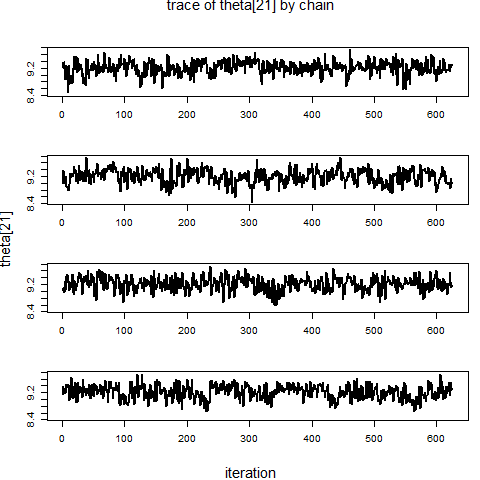
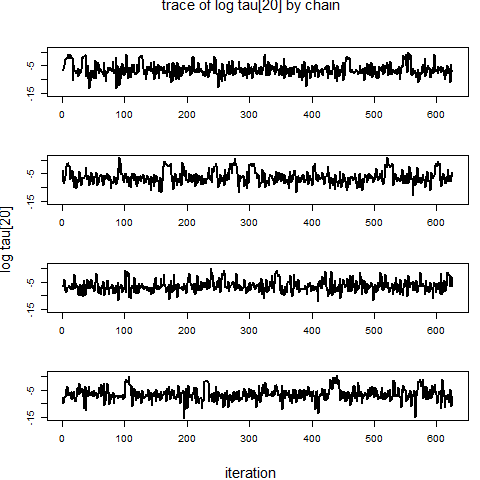
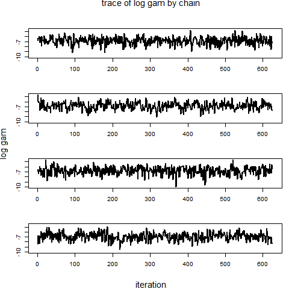
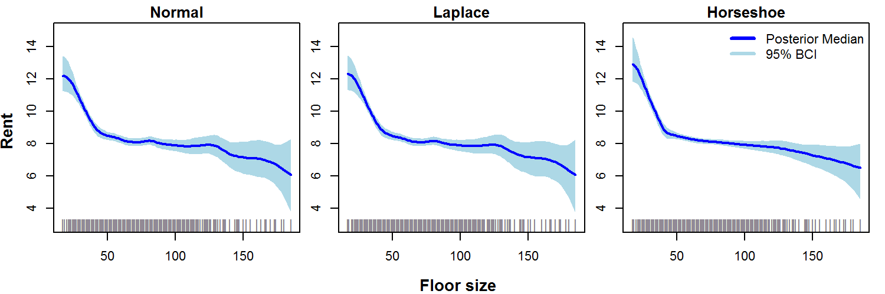

The following document provides `R` code for fitting shrinkage prior Markov random field models using the `spmrf` package for cases when the observations are measured on a grid with unequal spacing or when there are mutliple observations per grid location.  The case with unequal grid spacing can be applied to a nonparametric regression setting where the observations are regressed against a continuous covariate.  We explore a data example using data on rental prices in Munich as a function of a continuous covariate, which was presented in the supplemental materials for Faulkner and Minin (2017). See the [Introduction to the spmrf package](introduction_to_spmrf.html) for instructions on installation and more details about the package.

The approach for dealing with multiple observations per location, grids with unequally spaced locations, or continuous covariates is the same. The default assumption is that data are measured on a grid with equally-spaced locations and there is a single observation per location.  If that is the case, there is no need to specify the variable `xvar1` in the data list. However, if that is not the case, then the variable `xvar1` will provide the measurement locations (e.g., times) or covariate values.

## Multiple Observations per Location

Here we generate some data for multiple observations per location and show how to set up the model to handle it.

The following code uses a sine function as the underlying trend for generating data. We generate different numbers of observations per observation location.  Here the grid locations are equally spaced, but they do not need to be.

```{r eval=FALSE}
# First make sure spmrf is installed and loaded
library(spmrf)

# number of grid locations
nloc <- 50

# number of observations per grid location
nobs_per_loc <- sample(1:5, size=nloc, replace=T) 

# location ID variable
locID <- rep(1:nloc, nobs_per_loc)

# value of underlying trend function for each obs
mu.vec <- 10 + 20*sin(2*pi*locID/nloc ) 

# generate normal obs
y.vec <- rnorm(n=length(mu.vec), mean=mu.vec, sd=2)

```

Now we just need to include the `locID` as `xvar1` in our data list that will be fed to the `spmrf`.

```{r eval=FALSE}
# Set up the data list
multi_dat <- list(y = y.vec, xvar1 = locID)

```

That is all that needs to be done to let `spmrf` know how to set up the model once the data are passed in.


## Munich Rent Example 

### Data

The response variable is the rent (in Euros) per square meter for rental units in Munich, Germany, in 2003. There are 2,035 observations in the data set.  We will focus on the covariate for floor size in square meters (fsize).  The following code loads the `munich` data frame and creates a list with the data components needed for `spmrf` to run the models.  See the package documentation for more details on the `munich` data set.

```{r eval=FALSE}
# Load munich data
data(munich)

# Set up data list for spmrf
# for using floor size as the covariate
mun_dat <- list(y = munich$rent, xvar1 = munich$fsize)

```

### Set the Hyperparameters

Next we want to get reasonable values for the hyperparameter `zeta`, which controls the scale (and median) of the prior on the global scale parameter `gamma` (see Faulkner and Minin (2017) for details).  We will be using second order models and will assume the rent values are normally distributed conditional on the trend. We will use a probability of `alpha` = 0.05 that the marginal standard deviation of the trend parameters will exceed the upper bound, where the upper bound is set equal to the standard deviation of the response variable. The following code calculates a value of `zeta` given these assumptions for the floor size variable. The same value of `zeta` will be used for each model.  We have to calculate the number of unique grid locations (covariate values) first before calculating `zeta`.

```{r eval=FALSE}

# Calculate number of grid locations for covariate
nfs <- length(unique(munich$fsize))  # 134 floor space values

# Calculate zeta values associated with the covariate
zeta_fs <- set_zeta(yvec = munich$rent, linkfun = "identity", ncell = nfs, alpha=0.05, order=2)

```


### Run Models

As with other examples in Faulkner and Minin (2017), we will fit three separate models, where each has a different configuration for the prior distributions on the order-2 differences in latent function values (normal, Laplace, and horseshoe). We will use se  The following code will set up a list of parameters to keep in the output, set up some model run parameters, and will run the models with the `spmrf` function.  Then the posterior samples are extracted into an array and posterior median and 95% Bayesian credible intervals are calculated for the theta (latent trend) parameters.  

Note that with 2,035 observations and with second order models these will take quite awhile to run. The code below sets up the models to run in sequence and the chains to run in sequence within each model.  When I ran these models, the normal model took about 19 minutes to run per chain, the Laplace model about 25 minutes per chain, and the horseshoe about 96 minutes per chain. The total time to run these three models in sequence was about 9.3 hours. Of course results will differ depending on your computer set up. If you are using a computer that has multiple processer cores you may consider trying to run the chains in paralell as described in the [Introduction to the spmrf package](introduction_to_spmrf.html) vignette.  

Also note that the difficult posterior terrain induced by the horshoe model requires adjustment of some of the tuning parameters for the NUTS algorithm in `stan` to allow better adaptation during warmup and subsequently better performance during sampling. Divergent transitions after warmup may still occur, but a small number of them is not a problem if other posterior diagnostics look acceptable.


```{r eval=FALSE}

library(rstan)

# Parameters to keep 
pars.N <- c("theta", "gam") 
pars.L <- c("theta", "tau", "gam") 
pars.H <- c("theta", "tau", "gam") 

# MCMC settings
nchain <- 4
ntotsamp <- 2500
nthin <- 5
nburn <- 1500
niter <- (ntotsamp/nchain)*nthin + nburn

# Run models
mfit.N <- spmrf(prior="normal", likelihood="normal", order=2, data=mun_dat, par=pars.N, 
					zeta = zeta_fs, chains=nchain, warmup=nburn, thin=nthin, iter=niter)
mfit.L <- spmrf(prior="laplace", likelihood="normal", order=2, data=mun_dat, par=pars.L, 
					zeta = zeta_fs, chains=nchain, warmup=nburn, thin=nthin, iter=niter)
mfit.H <- spmrf(prior="horseshoe", likelihood="normal", order=2, data=mun_dat, par=pars.H,zeta = zeta_fs, chains=nchain, warmup=nburn, thin=nthin, iter=niter, control=list(adapt_delta=0.995, max_treedepth=12))

# Extract posterior draws
mout.N <- as.array(mfit.N)  
mout.L <- as.array(mfit.L)
mout.H <- as.array(mfit.H)

# Get posterior summary for theta
th.N <- extract_theta(mfit.N)
th.L <- extract_theta(mfit.L)
th.H <- extract_theta(mfit.H)

```


## Diagnostics

Next we check some posterior diagnostics of the parameters.  The `print.stanfit` function (called with `print`) from the `rstan` package provides posterior summaries of the parameters and effective sample size estimates and Gelman-Rubin statistics.  We use the `plot_trace` function from the `spmrf` package to check the traces of a few parameters for the horseshoe model.  Two of those plots are shown below. 

```{r eval=FALSE}

# Print parameter summaries
print(mfit.N, pars=pars.N)
print(mfit.L, pars=pars.L)
print(mfit.H, pars=pars.H)

# Some example trace plots for the horseshoe model
plot_trace(mout.H, "theta[21]", pscale="original", stack=TRUE, colset="black")
plot_trace(mout.H, "tau[20]", pscale="log", stack=TRUE, colset="black")
plot_trace(mout.H, "gam", pscale="log", stack=TRUE, colset="black")


```






## Posterior Plots

Now we use the `plot_trend` function from the `spmrf` package to plot the posterior medians and 95% credible intervals for the three models along with the data points.  See the documentation for `plot_trend` for more details on the available options.  The code below produces a PNG file, but you can simply pull out the calls to `plot_trend` for your own use.

```{r eval=FALSE}

# make variable with unique floor sizes sorted
ufsize <- sort(unique(munich$fsize))

# set range of y-axis 
yrng <- c(3, 15)

png(filename='rent_plots.png', width=1500, height=500, res=200)
  par(mfrow=c(1,3), mar=c(2,1.5,1.5,1), oma=c(2,2,0,0))
  plot_trend(theta=th.N, obstype="normal", uxvar=ufsize, main="Normal",	xlab="", ylab="",                     ylim=yrng, trend.lwd=2)
  points(ufsize, rep(3, length(ufsize)), pch="|", col="gray50")
  plot_trend(theta=th.L, obstype="normal", uxvar=ufsize, main="Laplace", xlab="", ylab="",                    ylim=yrng, trend.lwd=2)
  points(ufsize, rep(3, length(ufsize)), pch="|", col="gray50")
  plot_trend(theta=th.H, obstype="normal", uxvar=ufsize, main="Horseshoe",	xlab="",                          ylab="", ylim=yrng, trend.lwd=2)
  points(ufsize, rep(3, length(ufsize)), pch="|", col="gray50")
 legend(x="topright", legend=c("Posterior Median", "95% BCI"), col=c("blue","lightblue"),          lwd=3, bty="n", cex=1)
 mtext(side=1, outer=T, line=1, text="Floor size", font=2, cex=0.8)
 mtext(side=2, outer=T, line=1, text="Rent", font=2, cex=0.8)
dev.off()


```




## References

Faulkner, J.R., and V.N. Minin.  2017. [Locally adaptive smoothing with Markov random fields and shrinkage priors](http://projecteuclid.org/euclid.ba/1487905413), Bayesian Analysis, advance publication.
